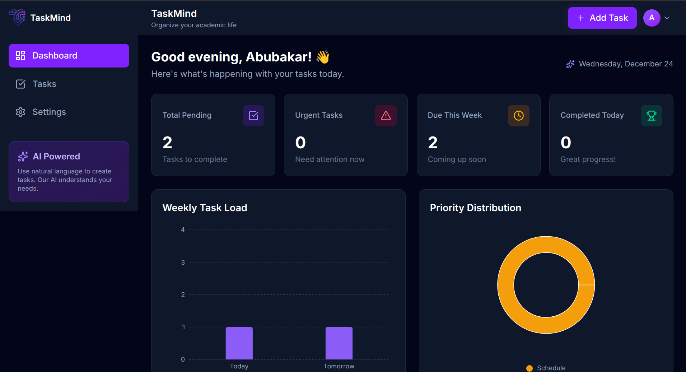
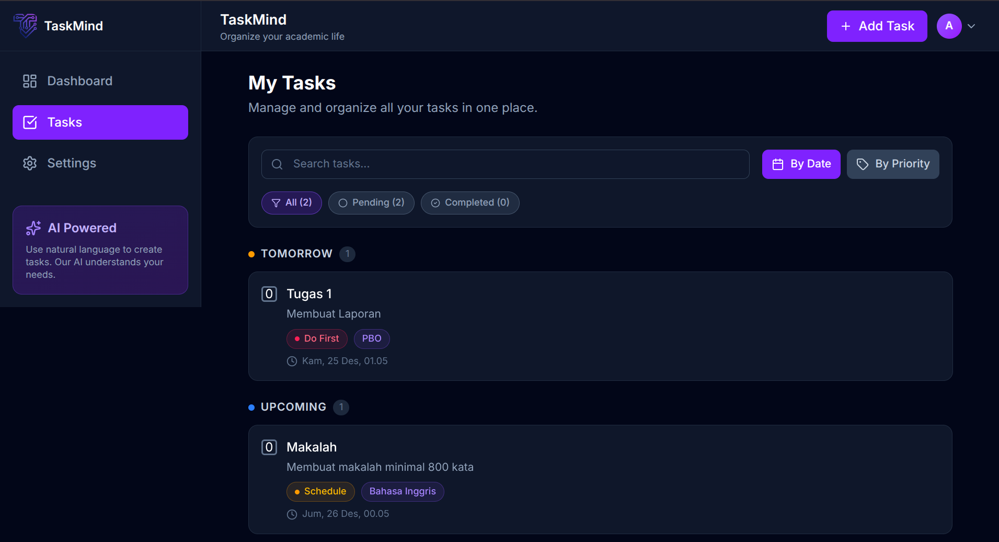
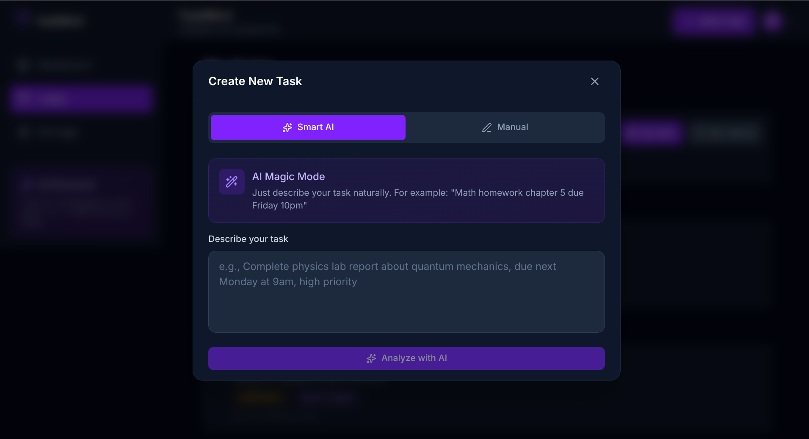

# TaskMind - Smart Task Manager

<div align="center">


**AI-Powered Task Management with Eisenhower Matrix & Smart Notifications**

[](https://nodejs.org/)
[](https://reactjs.org/)
[](https://www.mysql.com/)

[Demo](https://smart-task-manager-ecru.vercel.app/) · [Report Bug](https://github.com/AdniAlts/smart-task-manager/issues) · [Request Feature](https://github.com/AdniAlts/smart-task-manager/issues)

</div>

---

## Table of Contents

- [About](#-about)
- [Features](#-features)
- [Tech Stack](#-tech-stack)
- [Project Structure](#-project-structure)
- [API Documentation](#-api-documentation)

---

## About

**TaskMind** is an intelligent task management application that helps you organize, prioritize, and never miss a deadline. Powered by Google Gemini AI, it automatically categorizes your tasks using the Eisenhower Matrix and sends smart notifications via Telegram and Email.

Perfect for students, professionals, and anyone who wants to boost productivity with AI assistance.

### Why TaskMind?

- **AI-Powered Analysis**: Automatically categorize tasks using Eisenhower Matrix
- **Multi-Channel Notifications**: Get reminders via Telegram and Email
- **Smart Reminders**: 24-hour and 1-hour deadline notifications
- **Visual Dashboard**: Track your productivity with beautiful charts
- **Modern UI**: Clean, responsive design with dark mode

---

## Features

### Task Management
- Create, read, update, delete tasks
- Search and filter tasks
- Set deadlines and priorities
- Rich task descriptions
- AI-powered task analysis with Google Gemini

### Eisenhower Matrix
- **Do First** (Urgent & Important) - 🔴 High priority
- **Schedule** (Not Urgent but Important) - 🟡 Medium priority
- **Delegate** (Urgent but Not Important) - 🔵 Low priority
- **Eliminate** (Neither Urgent nor Important) - ⚪ Lowest priority

### Smart Notifications
- **Telegram Bot Integration**: Real-time notifications
- **Email Notifications**: Powered by Brevo (SendinBlue)
- **Dual Reminders**: 24-hour and 1-hour before deadline
- **Customizable**: Toggle notifications on/off per channel

### Analytics Dashboard
- Task completion trends
- Priority distribution charts
- Productivity insights
- Weekly/monthly statistics

### User Experience
- Modern dark theme with violet accents
- Fully responsive design (mobile, tablet, desktop)
- Fast navigation with React Router
- Smooth animations and transitions
- Intuitive UI with Lucide icons

---

## Tech Stack

### Frontend
- **Framework**: React 19.2 with Vite
- **Styling**: Tailwind CSS 4.1
- **State Management**: React Context API
- **Routing**: React Router DOM 7
- **HTTP Client**: Axios
- **Charts**: Recharts
- **Icons**: Lucide React
- **Notifications**: React Hot Toast

### Backend
- **Runtime**: Node.js 18+
- **Framework**: Express 5
- **Database**: MySQL 8.0
- **ORM**: mysql2 (raw queries)
- **Authentication**: JWT + bcryptjs
- **AI Integration**: Google Gemini AI
- **Email Service**: Brevo (SendinBlue)
- **Telegram Bot**: node-telegram-bot-api
- **Scheduler**: node-cron

### DevOps & Deployment
- **Backend Hosting**: Railway
- **Frontend Hosting**: Vercel
- **Database**: Railway MySQL
- **CI/CD**: Git-based auto-deploy

---

## Project Structure

```
smart-task-manager/
├── client/                    # Frontend React app
│   ├── public/               # Static assets
│   ├── src/
│   │   ├── components/       # React components
│   │   │   ├── auth/        # Auth components
│   │   │   ├── dashboard/   # Dashboard widgets
│   │   │   ├── layout/      # Layout components
│   │   │   ├── tasks/       # Task components
│   │   │   └── ui/          # UI components
│   │   ├── context/         # React Context
│   │   ├── pages/           # Page components
│   │   ├── services/        # API services
│   │   ├── App.jsx          # Main app component
│   │   └── main.jsx         # Entry point
│   ├── package.json
│   └── vite.config.js
│
├── src/                      # Backend Node.js app
│   ├── config/              # Configuration
│   │   └── database.js      # MySQL connection
│   ├── controllers/         # Route controllers
│   │   ├── authController.js
│   │   ├── taskController.js
│   │   └── dashboardController.js
│   ├── middleware/          # Express middleware
│   │   └── authMiddleware.js
│   ├── models/              # Database models
│   │   └── taskModel.js
│   ├── routes/              # API routes
│   │   ├── authRoutes.js
│   │   ├── taskRoutes.js
│   │   └── dashboardRoutes.js
│   ├── services/            # Business logic
│   │   ├── aiService.js     # Google Gemini integration
│   │   ├── emailService.js  # Email notifications
│   │   └── scheduler.js     # Cron jobs
│   ├── app.js               # Express app
│   └── telegram-bot.js      # Telegram bot
│
├── database/
│   └── schema-mysql.sql     # Database schema
│
├── docs/
│   └── screenshots
│   │   ├── dashboard.png
│   │   ├── magic-input.png
│   │   └── tasks.png
├── .env.example             # Backend env template
├── package.json             # Backend dependencies
├── railway.toml             # Railway config
└── README.md               # This file
```

---

## API Documentation

### Authentication

```http
POST /api/auth/register
POST /api/auth/login
GET  /api/auth/me
```

### Tasks

```http
GET    /api/tasks           # Get all user tasks
GET    /api/tasks/:id       # Get single task
POST   /api/tasks           # Create task
POST   /api/tasks/magic     # AI-powered task creation
PUT    /api/tasks/:id       # Update task
DELETE /api/tasks/:id       # Delete task
PATCH  /api/tasks/:id/toggle # Toggle task completion
```

### Dashboard

```http
GET /api/dashboard/stats    # Get dashboard statistics
```

### Request/Response Examples

**Create Task with AI**
```json
POST /api/tasks/magic
{
  "userInput": "Buat laporan proyek untuk Pak Budi deadline besok jam 5 sore"
}

Response:
{
  "title": "Buat Laporan Proyek",
  "description": "Laporan proyek untuk Pak Budi",
  "deadline": "2025-12-25T17:00:00Z",
  "priority_level": "do_first",
  "subject": "Proyek"
}
```

---

## Author

**AdniAlts**

- GitHub: [@AdniAlts](https://github.com/AdniAlts)
- Repository: [smart-task-manager](https://github.com/AdniAlts/smart-task-manager)

---

## Screenshots

*Add your app screenshots here*

### Dashboard


### Task List


### AI Task Creation


---

<div align="center">

**Built with ❤️ by AdniAlts**

⭐ Star this repo if you find it helpful!

</div>
