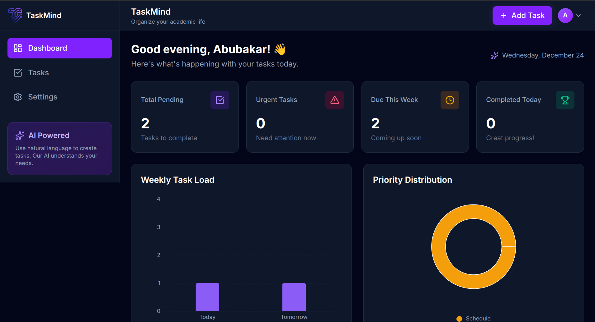
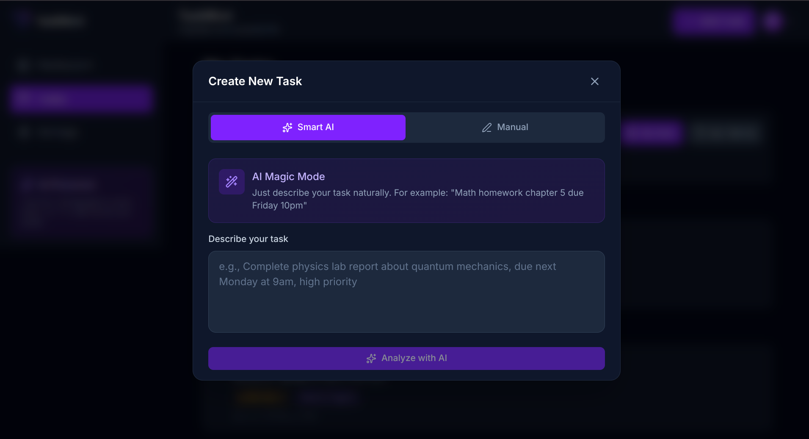
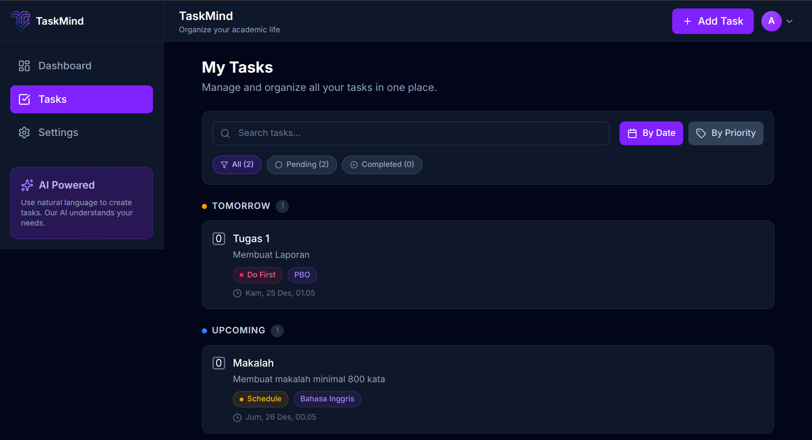

# 🚀 Smart Task Manager (TaskMind)

> AI-powered task management application with intelligent scheduling, natural language processing, and automated notifications.

[](https://vercel.com/new/clone?repository-url=https://github.com/AdniAlts/smart-task-manager)
[](LICENSE)
[](https://nodejs.org)
[](https://reactjs.org)

---

## ✨ Features

### 🤖 AI-Powered Task Creation
- **Magic Input**: Create tasks using natural language in Indonesian or English
- Automatically extracts title, description, deadline, and priority
- Powered by Google Gemini AI (Gemini 2.5 Flash)

### 📊 Smart Dashboard
- Real-time analytics and productivity metrics
- Visual charts showing task distribution by status and priority
- Eisenhower Matrix prioritization

### 🔔 Intelligent Notifications
- **Email notifications** for upcoming deadlines
- **Telegram bot integration** for instant alerts
- Customizable notification timing (hourly checks)

### 📱 Modern UI/UX
- Responsive design with TailwindCSS 4
- Dark mode interface
- Smooth animations and transitions
- Mobile-friendly

### 🔐 Secure Authentication
- JWT-based authentication
- Bcrypt password hashing
- Protected routes

---

## 🏗️ Tech Stack

### Frontend
- **React 19** - UI library
- **Vite** - Build tool
- **TailwindCSS 4** - Styling
- **Recharts** - Data visualization
- **Lucide Icons** - Icon system
- **React Router** - Navigation
- **Axios** - HTTP client

### Backend
- **Node.js** - Runtime
- **Express** - Web framework
- **MySQL** - Database
- **JWT** - Authentication
- **Bcrypt** - Password hashing

### AI & Integrations
- **Google Gemini AI** - Natural language processing
- **Telegram Bot API** - Instant notifications
- **Nodemailer** - Email service
- **Node-Cron** - Scheduled tasks (Railway) / Vercel Cron (Vercel)

### Deployment
- **Vercel** - Serverless hosting (current)
- **Railway** - Previous hosting (traditional server)
- **PlanetScale** - Database (recommended)

---

## 📋 Prerequisites

- Node.js 18+ and npm
- MySQL database (local or hosted)
- Google Gemini API key
- Telegram Bot token (optional)
- Email service credentials (optional)

---

## 🚀 Quick Start

### 1. Clone Repository

```bash
git clone https://github.com/AdniAlts/smart-task-manager.git
cd smart-task-manager
```

### 2. Install Dependencies

```bash
# Backend
npm install

# Frontend
cd client
npm install
cd ..
```

### 3. Setup Environment Variables

```bash
# Copy example env file
cp .env.example .env

# Edit .env with your credentials
nano .env
```

Required variables:
```env
# Database
MYSQL_HOST=localhost
MYSQL_PORT=3306
MYSQL_USER=root
MYSQL_PASSWORD=your_password
MYSQL_DATABASE=smart_task_manager

# JWT
JWT_SECRET=your-super-secret-key

# Google Gemini AI
GEMINI_API_KEY=your-gemini-api-key

# Telegram (optional)
TELEGRAM_BOT_TOKEN=your-telegram-bot-token

# Email (optional)
EMAIL_HOST=smtp.gmail.com
EMAIL_PORT=587
EMAIL_USER=your-email@gmail.com
EMAIL_PASSWORD=your-app-password

# Frontend URL
FRONTEND_URL=http://localhost:5173
```

### 4. Setup Database

```bash
# Import SQL schema
mysql -u root -p < database/schema-mysql.sql

# Or use MySQL Workbench/phpMyAdmin to import the schema
```

### 5. Run Development Servers

```bash
# Terminal 1 - Backend
npm run dev

# Terminal 2 - Frontend
cd client
npm run dev
```

Open http://localhost:5173 in your browser.

---

## 🌐 Deployment to Vercel

### Option 1: One-Click Deploy

[](https://vercel.com/new/clone?repository-url=https://github.com/AdniAlts/smart-task-manager)

### Option 2: Manual Deploy

See detailed guides:
- **[📘 Complete Deployment Guide](VERCEL_DEPLOYMENT.md)**
- **[📊 Migration Summary](MIGRATION_SUMMARY.md)**
- **[✅ Deployment Checklist](DEPLOYMENT_CHECKLIST.md)**
- **[🗄️ Database Migration](DATABASE_MIGRATION.md)**
- **[⏰ GitHub Actions Cron Setup](GITHUB_ACTIONS_CRON.md)**

Quick steps:

```bash
# Install Vercel CLI
npm install -g vercel

# Deploy
vercel

# Add environment variables in Vercel dashboard
# Setup Telegram webhook
./setup-telegram-webhook.sh

# Test deployment
./test-deployment.sh
```

---

## 📁 Project Structure

```
smart-task-manager/
├── api/                          # Vercel serverless functions
│   ├── index.js                  # Main API handler
│   ├── telegram-webhook.js       # Telegram webhook
│   └── cron-notifications.js     # Scheduled notifications
├── client/                       # React frontend
│   ├── src/
│   │   ├── components/          # React components
│   │   ├── pages/               # Page components
│   │   ├── services/            # API services
│   │   ├── context/             # React context
│   │   └── assets/              # Static assets
│   └── public/                   # Public assets
├── src/                          # Express backend
│   ├── controllers/             # Route controllers
│   ├── models/                  # Data models
│   ├── routes/                  # API routes
│   ├── services/                # Business logic
│   │   ├── aiService.js         # Gemini AI integration
│   │   ├── emailService.js      # Email notifications
│   │   └── scheduler.js         # Cron jobs
│   ├── middleware/              # Express middleware
│   ├── config/                  # Configuration
│   ├── app.js                   # Express app (Railway)
│   └── telegram-bot.js          # Telegram bot (Railway)
├── database/                     # Database schemas
├── docs/                         # Documentation & screenshots
├── .github/workflows/           # GitHub Actions
│   └── hourly-notifications.yml # Cron job alternative
├── vercel.json                  # Vercel configuration
└── package.json                 # Dependencies
```

---

## 🤖 AI Magic Input Examples

The AI understands natural language in both English and Bahasa Indonesia:

**English:**
- "Submit report tomorrow at 2pm with high priority"
- "Meeting with client next Monday afternoon"
- "Buy groceries this weekend"

**Bahasa Indonesia:**
- "Kumpulin tugas besok jam 2 siang prioritas tinggi"
- "Meeting dengan klien Senin depan sore"
- "Beli groceries akhir pekan ini"

The AI automatically:
- Extracts task title and description
- Parses dates and times
- Determines priority level
- Sets appropriate deadlines

---

## 📱 Telegram Bot Setup

### 1. Create Bot

```bash
# 1. Message @BotFather on Telegram
# 2. Send /newbot
# 3. Follow instructions
# 4. Copy the bot token
```

### 2. Get Your Chat ID

```bash
# 1. Send /start to your bot
# 2. Bot will reply with your chat ID
# 3. Add chat ID to your profile in TaskMind settings
```

### 3. Setup Webhook (Vercel)

```bash
./setup-telegram-webhook.sh
```

Or manually:
```bash
curl -X POST "https://api.telegram.org/bot<TOKEN>/setWebhook" \
  -H "Content-Type: application/json" \
  -d '{"url": "https://your-app.vercel.app/api/telegram-webhook"}'
```

---

## 📧 Email Notifications Setup

### Gmail Example

1. **Enable 2-Factor Authentication** in your Google Account
2. **Generate App Password**:
   - Go to Google Account → Security
   - 2-Step Verification → App passwords
   - Generate password for "Mail"
3. **Add to environment variables**:
   ```env
   EMAIL_HOST=smtp.gmail.com
   EMAIL_PORT=587
   EMAIL_USER=your-email@gmail.com
   EMAIL_PASSWORD=generated-app-password
   ```

### Other Email Providers

Update `EMAIL_HOST` and `EMAIL_PORT`:
- **Outlook**: smtp-mail.outlook.com:587
- **Yahoo**: smtp.mail.yahoo.com:587
- **SendGrid**: smtp.sendgrid.net:587

---

## 🔧 API Endpoints

### Authentication
```
POST   /api/auth/register      # Register new user
POST   /api/auth/login         # Login user
GET    /api/auth/profile       # Get user profile
PUT    /api/auth/profile       # Update profile
```

### Tasks
```
GET    /api/tasks              # Get all tasks (with filters)
POST   /api/tasks              # Create task
POST   /api/tasks/magic        # Create task with AI
GET    /api/tasks/:id          # Get task by ID
PUT    /api/tasks/:id          # Update task
DELETE /api/tasks/:id          # Delete task
```

### Dashboard
```
GET    /api/dashboard/stats    # Get statistics
GET    /api/dashboard/charts   # Get chart data
```

### Cron (Internal)
```
POST   /api/cron-notifications # Trigger notifications (requires auth)
```

---

## 🧪 Testing

```bash
# Test backend API
curl http://localhost:3000/api

# Test AI magic input
curl -X POST http://localhost:3000/api/tasks/magic \
  -H "Content-Type: application/json" \
  -H "Authorization: Bearer YOUR_JWT_TOKEN" \
  -d '{"userText": "Meeting tomorrow at 2pm"}'

# Test deployment
./test-deployment.sh
```

---

## 🐛 Troubleshooting

### Database Connection Issues
```bash
# Check MySQL is running
sudo systemctl status mysql

# Test connection
mysql -u root -p

# Check credentials in .env
```

### Vercel Deployment Issues
```bash
# View logs
vercel logs --follow

# Check environment variables
vercel env ls

# Redeploy
vercel --prod
```

### Telegram Webhook Issues
```bash
# Check webhook status
curl "https://api.telegram.org/bot<TOKEN>/getWebhookInfo"

# Delete webhook
curl -X POST "https://api.telegram.org/bot<TOKEN>/deleteWebhook"
```

See [VERCEL_DEPLOYMENT.md](VERCEL_DEPLOYMENT.md#troubleshooting) for more.

---

## 📸 Screenshots


*Real-time analytics dashboard*


*AI-powered task creation*


*Task management interface*

---

## 🗺️ Roadmap

- [ ] Mobile app (React Native)
- [ ] Recurring tasks
- [ ] Team collaboration
- [ ] Task templates
- [ ] Calendar integration
- [ ] Voice input for task creation
- [ ] Dark/Light theme toggle
- [ ] Export tasks to PDF/CSV
- [ ] Subtasks and dependencies
- [ ] Time tracking

---

## 🤝 Contributing

Contributions are welcome! Please feel free to submit a Pull Request.

1. Fork the repository
2. Create your feature branch (`git checkout -b feature/AmazingFeature`)
3. Commit your changes (`git commit -m 'Add some AmazingFeature'`)
4. Push to the branch (`git push origin feature/AmazingFeature`)
5. Open a Pull Request

---

## 📄 License

This project is licensed under the ISC License - see the [LICENSE](LICENSE) file for details.

---

## 👨‍💻 Author

**AdniAlts**
- GitHub: [@AdniAlts](https://github.com/AdniAlts)
- LinkedIn: [Your LinkedIn Profile]

---

## 🙏 Acknowledgments

- Google Gemini AI for natural language processing
- Vercel for hosting platform
- PlanetScale for database hosting
- All open-source libraries used in this project

---

## 📚 Documentation

- [Vercel Deployment Guide](VERCEL_DEPLOYMENT.md)
- [Database Migration Guide](DATABASE_MIGRATION.md)
- [GitHub Actions Cron Setup](GITHUB_ACTIONS_CRON.md)
- [Migration Summary](MIGRATION_SUMMARY.md)
- [Deployment Checklist](DEPLOYMENT_CHECKLIST.md)

---

## 💬 Support

If you have any questions or need help, please:
- Open an issue on GitHub
- Contact via email
- Join our community discussions

---

**Made with ❤️ using React, Node.js, and AI**
